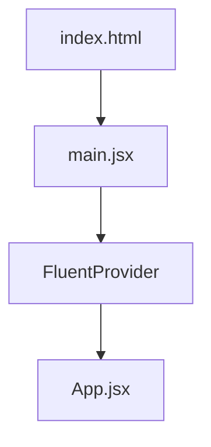
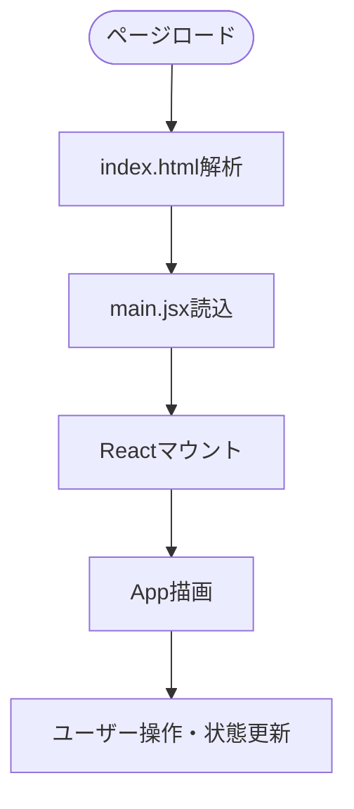
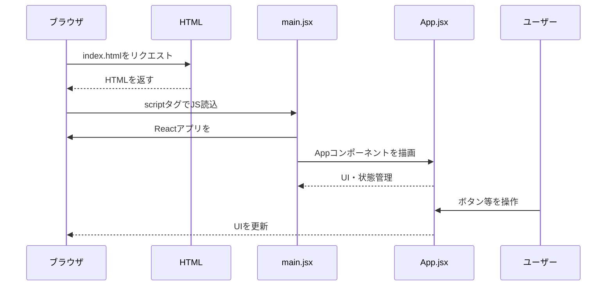

# Webページの処理フロー解説

このドキュメントでは、Vite + Reactプロジェクトにおける「Webページが開いてから、どのような流れで処理が行われるか」を解説します。

---

## 1. 全体の流れ

1. ブラウザが`index.html`を読み込む
2. `<script type="module" src="/src/main.jsx"></script>`でJavaScriptバンドルを読み込む
3. `main.jsx`でReactアプリを`#root`にマウント
4. `FluentProvider`でテーマを適用し、`App`コンポーネントを描画
5. `App.jsx`でUIや状態管理を実装
6. ユーザー操作に応じてReactがUIを更新

---

## 2. コンポーネント構成図



---

## 3. 処理フロー図



---

## 4. シーケンス図



---

## 5. main.jsxの詳しい解説

main.jsxは、Reactアプリの「エントリーポイント」と呼ばれるファイルです。  
このファイルの主な役割は、HTMLの中の`<div id="root"></div>`にReactアプリを組み込むことです。

### 主な処理内容

- `createRoot(document.getElementById('root'))`  
  → HTML内の`id="root"`の場所に、Reactアプリを表示する準備をします。

- `<FluentProvider theme={webLightTheme}>`  
  → Fluent UIというデザインフレームワークのテーマ（色や見た目）を全体に適用します。

- `<App />`  
  → アプリの本体（App.jsx）を呼び出して表示します。

### コード例と解説

```javascript
const root = createRoot(document.getElementById('root'));
root.render(
  <FluentProvider theme={webLightTheme}>
    <App />
  </FluentProvider>
);
```

- `createRoot`はReact 18以降の新しい書き方です。
- `FluentProvider`は、全体のデザインを統一するための「ラッパー」です。
- `App`は実際の画面や機能を持つコンポーネントです。

---

## 6. App.jsxの詳しい解説

App.jsxは、Reactの「関数コンポーネント」と呼ばれる書き方で作られています。  
このファイルでは、画面に表示する内容や、ボタンを押したときの動きを定義しています。

### 主な処理内容

- `useState`  
  → ボタンを押した回数（カウント）を記憶するための仕組みです。

- 画像やスタイルの読み込み  
  → ロゴ画像やCSSファイルをimportして、見た目を整えています。

- ボタンのクリックイベント  
  → ボタンを押すたびにカウントが1つ増え、画面が自動で更新されます。

### コード例と解説

```javascript
const [count, setCount] = useState(0);

<button onClick={() => setCount((count) => count + 1)}>
  count is {count}
</button>
```

- `useState(0)`で、最初は0からスタートします。
- `setCount`を使うと、カウントの値が変わり、画面も自動で書き換わります。
- `onClick`は「ボタンがクリックされたとき」の処理を指定します。

### 画面構成

- ViteとReactのロゴ画像
- カウントアップボタン
- ソースコード編集の案内
- ドキュメントへのリンク

---

## 5. 補足

- スタイルや画像アセットも同時に読み込まれます。
- ViteのHMR（Hot Module Replacement）により、開発中は即時反映されます。
